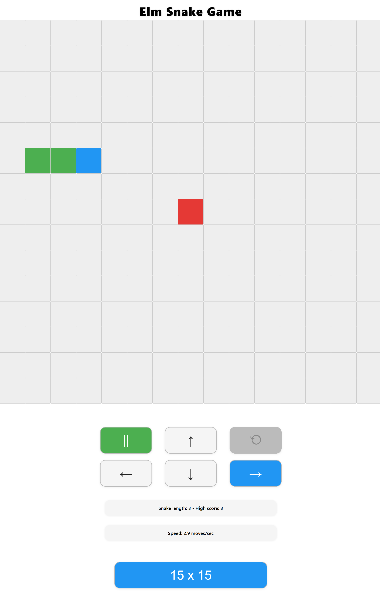

# Elm Snake Game



## 1. Introduction

This is a classic Snake game implemented in Elm, inspired by the version found on old Nokia phones. You control a snake that moves around a grid, eating food to grow longer. The goal is to grow your snake as long as possible without running into yourself. If you do collide with yourself, your snake will shrink by 3 segments, but the game continues—so you can keep playing and try to beat your high score!

**How to play:**
- Use the arrow keys (↑, ↓, ←, →) to change the direction of the snake.
- Eat the red food squares to grow longer.
- If you collide with yourself, you'll see a red "Collision!" warning and your snake will shrink.
- The snake wraps around the grid edges.
- The blue square is the head of the snake.

## 2. Getting Started

### Prerequisites
- [Elm](https://guide.elm-lang.org/install/elm.html) (version 0.19 or later)
- [elm-live](https://github.com/wking-io/elm-live) for live reloading during development
- [Node.js](https://nodejs.org/) (for installing elm-live)

### Installation & Running
1. **Clone the repository:**
   ```sh
   git clone <your-repo-url>
   cd elm-snake
   ```
2. **Install dependencies:**
   - Install Elm (if you haven't already):
     ```sh
     npm install -g elm
     ```
   - Install elm-live (for local development):
     ```sh
     npm install -g elm-live
     ```
3. **Run the game locally:**
   ```sh
   elm-live src/Main.elm --open --output=main.js
   ```
   This will open the game in your browser at [http://localhost:8000](http://localhost:8000).

## 3. Learnings from This Project

- **Elm is great for games:** The Elm architecture (Model, Update, View) makes it easy to manage game state and UI updates in a functional way.
- **Keyboard events:** Handling global keyboard events in Elm is done via `Browser.Events.onKeyDown` in the `subscriptions` function, not via HTML event attributes.
- **Grid rendering:** Rendering a grid in Elm is straightforward with nested `List.map` and inline styles.
- **Game logic:** We implemented movement, food, growth, collision detection, and custom penalties for collisions (shrinking the snake instead of ending the game).
- **UI polish:** Live feedback (snake length, collision warnings, colored head) makes the game more user-friendly and fun.
- **Iterative development:** Building the game step by step, testing each feature, and refining based on feedback led to a robust and enjoyable result.
- **Elm quirks:** Elm uses `modBy` for modular arithmetic, not `%`, and does not have a `List.init` function—so we learned to use custom helpers for list manipulation.

## 4. What is Vibe Coding? How Cursor Makes It Possible

**Vibe coding** is a modern, collaborative way of building software where a human developer and an AI assistant (like Cursor) work together in real time. Instead of working alone or searching for answers online, you "vibe" with the AI—asking questions, getting code suggestions, fixing bugs, and brainstorming features as you go.

**How Cursor enables vibe coding:**
- Cursor (the AI) can read your code, understand your goals, and make precise edits or suggestions.
- You can work step by step, get instant feedback, and iterate quickly—just like pair programming with a knowledgeable partner.
- Cursor helps with syntax, logic, best practices, and even project management (like writing this README).

**Skills needed for successful vibe coding today:**
- **Basic programming knowledge:** You should understand the language and tools you're using (in this case, Elm and the command line).
- **Communication:** Clearly describe what you want, what errors you see, and what you expect next.
- **Curiosity and willingness to experiment:** Vibe coding is about learning and building together, so being open to trying new things helps.
- **Critical thinking:** The AI is powerful, but you should still review suggestions, test changes, and make decisions.

Vibe coding with Cursor is a fun, fast, and effective way to build projects, learn new technologies, and solve problems—together! 